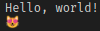

# C GOTO

Simple C kickoff for VSCode

C is a general-purpose, procedural, compiled programming language with a static, weak type system.

## Installing C on Windows

### https://www.msys2.org/

###

https://www.udemy.com/course/c-programming-in-windows/learn/lecture/17288232?start=0#overview

## Installing C on Arch-Linux

You can use C with different Compilers, Linkers and Build-Systems.

Here I will go with the GNU tool-chain.

Compiler: GNU Compiler-Collection:  
`pacman -S gcc`

C uses a preprocessor which comes with GCC.

The GNU linker and GNU Assembler:  
`pacman -S binutils`

`ld` & `as`

more programs from the package `binutils`:
```shell
addr2line
ar
as
c++filt
dwp
elfedit
gprof
ld
ld.bfd
ld.gold
nm
objcopy
objdump
ranlib
readelf
size
strings
strip
```

The GNU Build-System  
`pacman -S make`

The GNU Debugger  
`pacman -S gdb`

## VSCode integration

    ms-vscode.cpptools


## Hello World

```C
#include <stdio.h>
#include <stdlib.h>
#include <wchar.h>
#include <locale.h>

int main() {
    setlocale(LC_CTYPE, "");
    wprintf(L"Hello, world!\n");
    wchar_t cat = 0x1F63B;
    wprintf(L"%lc\n", cat);
    return EXIT_SUCCESS;
}
```

compile:  
`make first`  

or 

`gcc -o first first.c`

run:
`./first`  



## Make

`make` uses a file called `Makefile` or the makefile must be specified with `make -f`

In conjunction with C we give Compiler flags (params) and Linker flags

```makefile
# Compiler Flags:
C_FLAGS     = -no-pie -ggdb -Wall -Wextra -mtune=native

# Linker Flags
LD_FLAGS    = -lm

SRC_DIR	    = src/
BUILD_DIR    = dest/

TARGETS     = second

.PHONY: all
all: $(TARGETS)

second:   $(SRC_DIR)second.c
	@cc $(C_FLAGS) -o $(BUILD_DIR)$@ $+ $(LD_FLAGS)

# hot compile
# while inotifywait -e close_write ./code.c; do date +%X; make > /dev/null; done

.PHONY: clean
clean:
	@cd $(BUILD_DIR) && rm $(TARGETS) 2>/dev/null || true

# $<	first dependency
# $@	target name
# $+	list of all dependencies
# $^	list of all unique dependencies
```

## Projects

We don't use any scaffolding tools here.
You can write your own with Bash.

## Dependencies

In C runtime dependencies are usually called libraries.

During design time they are included with `#include $some_header.h`

```c
#include <stdio.h>
```

`#include` is a preprocessor directive.

During build time they are linked against

During runtime 

ldd

## use the dependency

```rust
use rand::Rng;

    const pseudo_rand = rand::thread_rng().gen_range(1..11);
    println!("Pseudo-Rand: {}", pseudo_rand);
```

## preprocessor directives

https://developerinsider.co/preprocessor-directives-c-programming/#:~:text=The%20C%20preprocessor%20is%20a,are%20executed%20before%20compilation.).


#include
#define
#undef
#ifdef
#ifndef
#if
#else
#elif
#endif
#error
#pragma

## Modules

```rust
// main.rs
mod hello;

fn main() {
    hello::print_hello();
}
```

```rust
// hello.rs
pub fn print_hello() {
    println!("Hello, world!");
}
```

    .vscode/tasks.json


    .vscode/launch.json


## Comments

// line comment  
/* block comment */  

    doc comments
///  
/**  */  

<https://doc.rust-lang.org/reference/comments.html>

## Variables

by default variables are mutable

```c
int x = 5;
x = 6;
```

## Constants

Can be declared global scope and **not** be computed at runtime!

```C
#define MAX_POINTS 100000;
```

## Types

## Scalars

four primary scalar types: 
- integers
- floating-point numbers
- Booleans
- characters

## Integer Literals


    Decimal         98_222
    Hex             0xff
    Octal           0o77
    Binary          0b1111_0000
    Byte (u8 only)  b'A'

## Floats

```rust
let x = 2.0; // f64

let y: f32 = 3.0; // f32
```

## Booleans

let f: bool = false;

## Characters

`char` type is four bytes in size and represents a Unicode Scalar Value

## Tuples

```rust
let tup: (i32, f64, u8) = (500, 6.4, 1);
let tup = (500, 6.4, 1);
let (x, y, z) = tup;
```

## Arrays

```rust
let a = [1, 2, 3, 4, 5];
let months = ["January", "February"];
```

## Functions

```rust
// params (input)
fn foo(x: i32)

// return values | results ( output)
fn five() -> i32 {
    5
}

fn plus_one(x: i32) -> i32 {
    x + 1
}
```
## Control Flow

```rust
let number = 3;

if number < 5 {
    println!("condition was true");
} else {
    println!("condition was false");
}

let condition = true;
let number = if condition { 5 } else { 6 };

    loop {
    println!("again!");
}

let mut counter = 0;

let result = loop {
    counter += 1;

    if counter == 10 {
        break counter * 2;
    }
};

let mut number = 3;

while number != 0 {
    println!("{}!", number);

    number -= 1;
}
```

## Advanced Tool-Chain

## References

https://wiki.archlinux.org/index.php/rust

https://www.rust-lang.org/

https://doc.rust-lang.org/book/ch01-00-getting-started.html

https://doc.rust-lang.org/reference/
