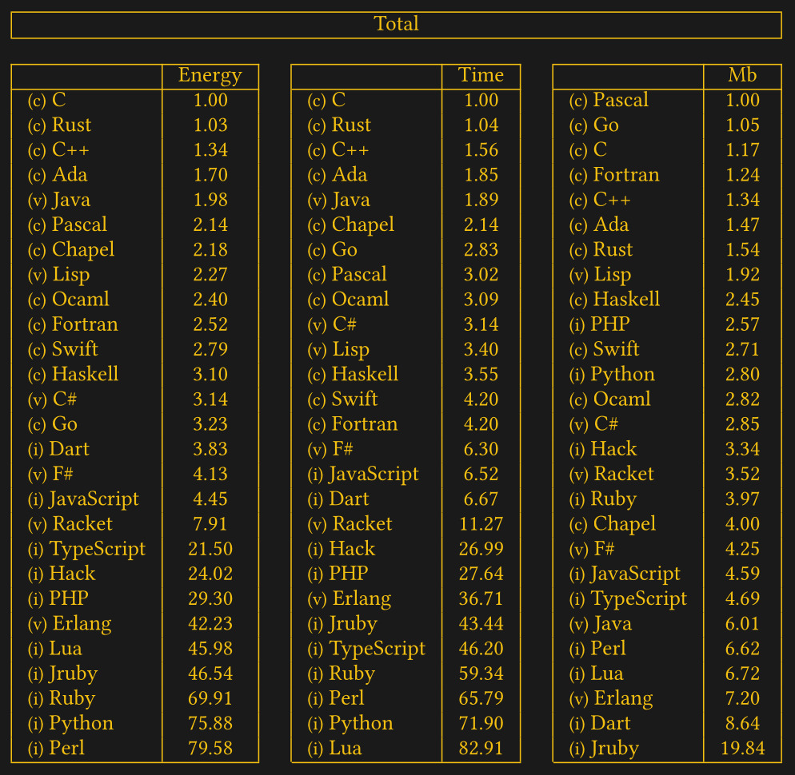

# Built in data types

Data Types in C care about the size of the data. The actual size is implementation-defined. It may depend on compiler, machine, compiler options etc.

```Python 3
import sys
a = 14
print(type(a)) // <class 'int'>
print(sys.getsizeof(a)) // Return the size of an object in bytes.
// 28 Bytes
```

In languages with high abstractions like Python, the size of data is less important for the developer. The interpreter will take care of it. That convenience comes with the cost of performance due to the overhead of memory that is used.

It's like you want to store a pair of shoes and you won't get a shoe carton but a shipping container.

That is one reason why Python is so slow and you do not want Python on poor hardware like a router or smaller embedded devices.



Image Source: https://hackaday.com/2021/11/18/c-is-the-greenest-programming-language/

## void

Declares that no type is needed.

```c
// nothing is returned
void foo(void) { // nothing is handed over
    // ...
}
```

## char - pseudo-type

```c
char key = 'a'; // saved as 8-Bit - 1 Byte integer, the decimal equivalent based on the ASCII-Table 
```

A char is guaranteed to be 8-Bit nowadays.

## int - whole numbers

These vary in size.

```c
short a = 999; // short integer
```
```c
int b = 999; // integer
```
```c
long c = 999; // long integer
```

## float - floating point numbers

```c
float f = 0.1f;
```

### double precision floats

```c
double g = 0.1f;
```

## modifiers

**sign**

`signed` and `unsigned`

Declare for the compiler that numbers can be negative or not.

signed is the default. One does not need to declare that.

+2 or -2, are signed numbers. Like when we talk and say: I want a 2 burgers. You won't tell the sign, because it's obvious.

Why does the sign matter?

One bit is reserved for the sign, that means that the maximum value is 2^(8-1) = 127. It's around the half of the maximum value.

**size**

`short`, `long`, `long long` for integer numbers.

and

`long double` for floating point numbers.

## Refs

https://en.wikipedia.org/wiki/C_data_types